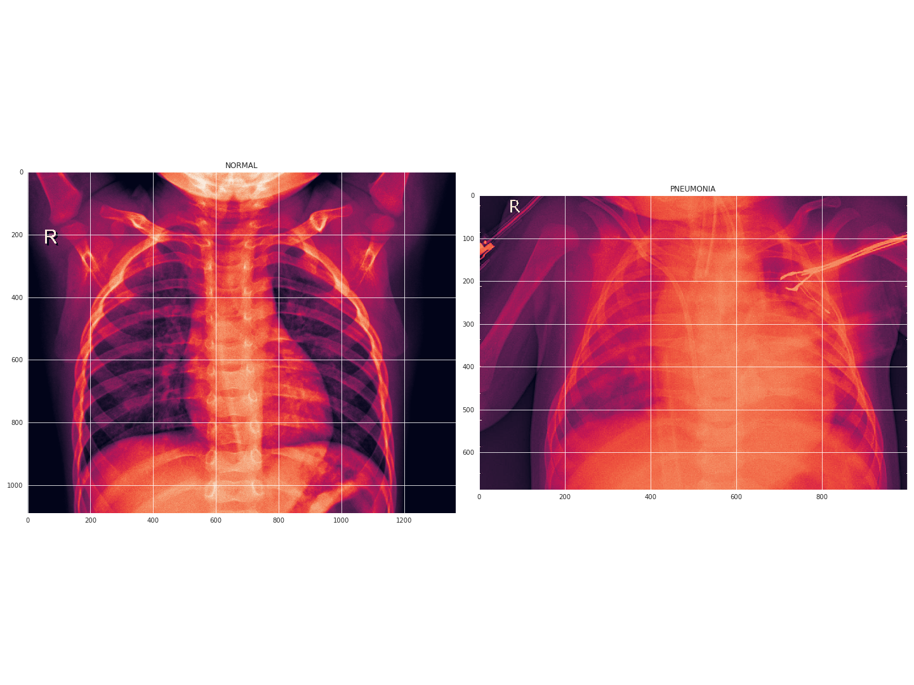
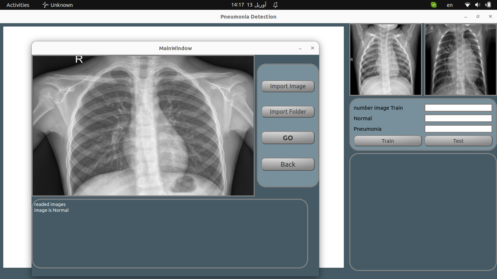

 # PNEUMONIA_detection
    Pneumonia is inflammation of the lungs, usually caused by an infection. Most people get better in 2 to 4 weeks, but babies, older people, and people with heart or lung conditions are at risk of getting seriously ill and may need treatment in hospital.

## Networke
    -- CNN
    -- Dataset X-Ray Image (downlod kaggel.com)
 
 ### smaple image
 
 ### image App
 